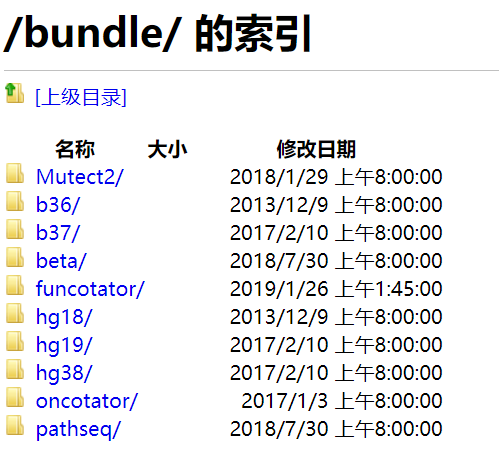

# ChromoPainter_AncientDNA


In the paper named "[Ancient Rome: A genetic crossroads of Europe andthe Mediterranean](https://science.sciencemag.org/content/366/6466/708)", the authors used the ChromoPainter on ancient individuals to calculate haplotype sharing between ancient Italian individuals and present-day
population, and to reveal fine population genetic structure.

Here, I am trying to repeat their ChromoPainter analysis, and we can use this method to do similar analysis on ancient DNA in the future.

## Download raw data that used in Ancient Rome paper

The author deposited their raw sequencing data at European Nucleotide Archive (ENA) with accession [no.PRJEB32566](https://www.ebi.ac.uk/ena/data/view/PRJEB32566). Samples in this repository include 127 from Rome and Central Italy, as well as 7 from Sardinia (Bronze/Copper Age) that were not reported in the study. They performed whole-genome sequencing to a median depth of 1.05× genome-wide coverage (range 0.4 to 4.0×, [TableS2](data/aay6826_Tables_S1_to_S4.xlsx)).


The indexed bam files (the bam file ```*.bam``` and the index file of the bam ```*.bam.bai```) can be download for each individuals from [PRJEB32566](https://www.ebi.ac.uk/ena/data/view/PRJEB32566) using the following commands in your terminal at designated directory, take downloading sample R7 for example：

```
wget ftp.sra.ebi.ac.uk/vol1/run/ERR355/ERR3559063/R7.bam
```
```
wget ftp.sra.ebi.ac.uk/vol1/run/ERR355/ERR3559063/R7.bam.bai
```

Links for all ```*.bam``` and ```*.bam.bai``` files can be found in [PRJEB32566.txt](data/PRJEB32566.txt). 


## Download the human reference: H.sapiens,UCSC hg19


The [hg19.build.sh](data/hg19.build.sh) script downloads sequences of chromosomes 1-22, X and Y from [UCSC directory](http://hgdownload.cse.ucsc.edu/goldenpath/hg19/chromosomes/) (University of California, Santa Cruz) and combines them in order.

```
#How to run

mkdir ucsc_hg19_fasta  #creat a new directory
cd ucsc_hg19_fasta     #go to the new directory

./hg19.build.sh hg19.fasta

or

bash hg19.build.sh hg19.fasta
````

Once the final FASTA file is produced, all intermediate files and directory are removed. Because the scripts creates temporary files, please run it in a freshly created directory (or ucsc_hg19_fasta).


**Reference:** [Build hg19.fasta](https://github.com/creggian/ucsc-hg19-fasta).


## Prepare the FASTA file to use as reference (hg19)


**Why these steps are necessary**

The GATK uses two files to access and safety check access to the reference files: a ```.dict``` dictionary of the contig names and sizes and a ```.fai``` fasta index file to allow efficient random access to the reference bases. You have to generate these files in order to be able to use a Fasta file as reference.


[How can I prepare a FASTA file to use as reference?](https://gatkforums.broadinstitute.org/gatk/discussion/1601/how-can-i-prepare-a-fasta-file-to-use-as-reference)


**Indexing ```hg19.fasta```  using samtools:**

```
samtools faidx hg19.fasta
```

You will get ```hg19.fasta.fai``` file.


**Creating the fasta sequence dictionary file for your reference**

Using ```CreateSequenceDictionary``` tool from ```Picard``` to create a ```.dict``` file for the ```hg19.fasta``` file.

```
java -jar picard.jar CreateSequenceDictionary R=hg19.fasta O=hg19.dict 
```
You will get ```hg19.dict``` file.

**Note:**

On our server, we have ```samtools``` installed, and you just need to download ```picart``` and you are good to go. Just in case if you want to run it on your local computer, see belows:


1. How to download and install [Samtools](http://www.htslib.org/).
2. Download and install Picart

You can download [Picart](https://broadinstitute.github.io/picard/). Note that it is not possible to add jar files to your path to make the tools available on the command line; you have to specify the full path to the jar file in your java command, which would look like this:

```java -jar ~/my_tools/jars/picard.jar <Toolname> [options]```

However, you can set up a shortcut called an "environment variable" in your shell profile configuration to make this easier. The idea is that you create a variable that tells your system where to find a given jar, like this:

```
export picard=/home/mianlee/Desktop/Software/gatk-4.1.2.0/picard.jar

#Ubuntu 16.04

```
So then when you want to run a Picard tool, you just need to call the jar by its shortcut, like this:

```
java -jar $picard <Toolname> [options]
```

## Directly download the prepared Human reference files (hg19) from GATK Resource Bundle

After I did all steps above, I found out that the **GATK resource bundle** is a collection of standard files for working with human resequencing data with the GATK. They provide several versions of the bundle corresponding to the various reference builds. So you don't have to build it by your self......

The bundle/ directory contains five subdirectories, one for each build of the human genome that we have resources for: b36, b37, hg18, hg19 and hg38 (aka GRCh38). Here you can go to the hg19 folder and download related files, in our case, ```ucsc.hg19.fasta.gz```, ```ucsc.hg19.fasta.fai.gz``` and ```ucsc.hg19.dict.gz```.

Unzip those files with 

```
gunzip XXXX.gz
```


**How do you do the downloading**

**1. FTP Server Access**

To access the bundle on the FTP server, use the following login credentials in your favorite FTP client:
```
    location: ftp.broadinstitute.org/bundle
    username: gsapubftp-anonymous
    password: (none, just hit enter)
```
If you use your browser as FTP client, make sure to include the login information in the address, otherwise you will access the general Broad Institute FTP instead of our team FTP. This should work as a direct link:
ftp://gsapubftp-anonymous@ftp.broadinstitute.org/bundle/

I tried their ways mentioned in [Resource Bundle](https://gatk.broadinstitute.org/hc/en-us/articles/360036212652-Resource-Bundle) above from my web brower to download the reference files, it didn't work for me and kept giving me "This site can’t be reached" error (MacBook Pro + Chrome). I don't know why this is happening or maybe the VPN issue since I was in China. But, at least you can try them first. If it worked, you would see the below:




**2. ```lftp``` tool**

If the first method doesn't work for you or you need to download those data onto your server, you can use the method below and aftet testing, it worked perfect for me.

Using ```lftp``` tool to visit and download reference data from ```ftp```. If you don't have ```lftp``` command installed on your server or local computer, you need to intall it first. After installation, enter the following command in your terminal:

```
lftp ftp://gsapubftp-anonymous@ftp.broadinstitute.org/bundle/

# There is no password, just hit the enter key
# gsapubftp-anonymous is the user name, @ftp.broadinstitute.org/bundle/ is the address of the GATK server
```

If you connected to the server, you will see something like below. You can use ```cd``` and ```ls``` command to navigate those files and folders.


You can use **```get```** command to download the file you need. Then you will get e.g. ```ucsc.hg19.fasta.gz```, ```ucsc.hg19.fasta.fai.gz``` and ```ucsc.hg19.dict.gz```.

```
get ucsc.hg19.fasta.gz
get ucsc.hg19.fasta.fai.gz
get ucsc.hg19.dict.gz

```

If you want to download all files under a certain folder, you can use ```mirror``` command. 


```
mirror hg19

```

**Reference**

[GATK Resource Bundle](https://gatk.broadinstitute.org/hc/en-us/articles/360036212652-Resource-Bundle).

[GATK数据下载](https://blog.csdn.net/xxxie_/article/details/100111991).

[Differences between b37 and hg19](https://github.com/bahlolab/bioinfotools/blob/master/GATK/resource_bundle.md).


## GRCh37/hg19/b37

There are some slightly difference between GRCh37,b37 and hg19 human reference. 


[GRCh37 hg19 b37 humanG1Kv37 - Human Reference Discrepancies](https://gatk.broadinstitute.org/hc/en-us/articles/360035890711?id=23390#comparison)

For example: 

1.The two versions of the reference genomes are not exactly the same. There are a few differences, for example some bases that are flipped between strands. That is why we have liftover chain files to convert between the two versions. So there may be a few variants that are filtered out in one version relative to the other. But this should affect only a tiny proportion of variants. [Reference](https://gatkforums.broadinstitute.org/gatk/discussion/1810/whats-the-difference-between-b37-and-hg19-resources)

2.There are a few minor differences between GRCh37 and hg19. The contig sequences are the same but the names are different, i.e. "1" may need to be converted to "chr1". In addition UCSC hg19 is currenly using the old mitochondrial sequence but NCBI and Ensembl have transitioned to NC_012920.

Citing UCSC:
"Since the release of the UCSC hg19 assembly, the Homo sapiens mitochondrion sequence (represented as "chrM" in the Genome Browser) has been replaced in GenBank with the record NC_012920. We have not replaced the original sequence, NC_001807, in the hg19 Genome. We plan to use the Revised Cambridge Reference Sequence (rCRS) in the next human assembly release."
[Reference](https://www.researchgate.net/post/Is_there_any_difference_between_HG_19_from_the_UCSC_and_GRCh37NCBI)

3. GRCh37 is identical to hg19 on the main contigs (chr1-24), but differ on chrM, as per Devon.

GRCh37d5 is different since there is a decoy sequence that may not be present in some hg19 builds. Also if memory serves me GRCh37 with or without decoy hard masks the pseudoautosomal regions on chrY, therefore you treat the pseudoautosomal region on chrX as diploid in males. I do not think some of the hg19 releases (UCSC I think) hardmask the PAR on chrY.Hardmask just means there are "N" nucleotides in that region.
[Reference](https://www.biostars.org/p/299799/)


**Use different version may cause some issues, I think.... I am kind of which reference I should I use to repeat Ancient Rome paper...I need to test this and figure it out**


## Genome Analysis Toolkit's (GATK's)


In oder to obtained the genotypes and likelihood scores for SNPs, the authors chose to use GATK ```UnifiedGenotyper```. Here, I quoted "We used ```UnifiedGenotyper``` instead of more recent genotype callers, such as ```HaplotypeCaller```, because it has the option to output genotype likelihood scores."

After I did some researches and found out the ```UnifiedGenotyper``` (GATK version 3.XXX, the old version) has been replaced by ```HaplotypeCaller``` (GATK version 4.XXX), which is a much better tool. And It also took me a while to find the program [**```GenomeAnalysisTK.jar```**](data/GenomeAnalysisTK.jar) (This is from GATK version 3.8.1) since it was being discontinued for two or three years, click the link to download.


**Note:**

Some links about this issue: 

1. [Legacy GATK code](https://gatk.broadinstitute.org/hc/en-us/articles/360035889571?id=4022). Also known as "Classic GATK", this covers major versions 1 through 3.

2. [How to donwload GATK version 3.8 forum](https://gatkforums.broadinstitute.org/gatk/discussion/11188/gatk-version-3-8-download).

3. **[GATK version 1.0 to 3.8 downloads](https://console.cloud.google.com/storage/browser/gatk-software/package-archive/gatk/), you may need a google account to access google cloud platform.**  I used this way to get ```GenomeAnalysisTK.jar```(v 3.8.1)


## Running UnifiedGenotyper

Because ```GenomeAnalysisTK.jar``` has different version, it is better to type the following command to see  Arguments for ```UnifiedGenotyper```.

```
java -jar GenomeAnalysisTK.jar -T UnifiedGenotyper --help
```

In the paper, the author didn't specify which version they used.

Here is the what parameters the paper used:

"First, genotypes and likelihood scores were obtained using GATK UnifiedGenotyper for variants at >0.01 minor allele frequency (MAF) in the 1000 Genomes global reference panel. 

The following parameters were used: 

--min_base_quality_score 30 

--output_mode EMIT_ALL_SITES 

--allSitePLs 

--alleles (reference_panel)

--genotyping_mode GENOYTPE_GIVEN_ALLELES 

-R (hg19 reference fasta)
  
We used UnifiedGenotyper instead of more recent genotype callers, such as HaplotypeCaller, because it has the option to output genotype likelihood scores. The likelihood scores model some of the uncertainty of the genotype due to the low coverage of the study samples, making them the preferred input (as opposed to called genotypes) for imputation."

I also added ```-glm``` or ```--genotype_likelihoods_model```for  <genotype_likelihoods_model> as the paper mentioned. This is the model that the program will use to calculate the genotype likelihoods. By default, it is set to ```SNP```, but it can also be set to ```INDEL``` or ```BOTH```. If set to ```BOTH```, both SNPs and Indels will be called in the same run and be output to the same variants file.


```
Java -jar GenomeAnalysisTK -T UnifiedGenotyper \
     --genotype_likelihoods_model \
     --min_base_quality_score 30 \
     --allSitePLs \
     --alleles <reference_panel> \
     --genotyping_mode GENOYTPE_GIVEN_ALLELES \
     --out_mode EMIT_ALL_SITES \
     -R hg19.fasta \
     -I input.bam \
     -o output.vcs 

```


